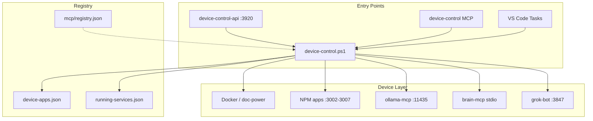

# Device & App Control

Unified interface to see and control local apps, services, MCPs, and device state on LEGION-LAP (Windows).

## Architecture



```
Device (Windows)
├── device-control.ps1      ← primary CLI
├── device-control-api      ← HTTP on 127.0.0.1:3920
├── device-control MCP      ← stdio tools for agents
└── Apps (device-apps.json)
    ├── docker: doc-power
    ├── npm: fun4kids, gcs-tech, cordev, study-portal, grok-bot
    ├── mcp/http: ollama, ollama-mcp
    └── stdio: brain-mcp
```

## Quick start

```powershell
# Full status (apps + git + docker)
F:\ai-workspace\scripts\device-control.ps1 status

# List registered app ids
F:\ai-workspace\scripts\device-control.ps1 apps

# Start one app (skip if port already listening)
F:\ai-workspace\scripts\device-control.ps1 start doc-power

# Start everything
F:\ai-workspace\scripts\device-control.ps1 start all

# Stop gracefully (never kills Cursor/VS Code)
F:\ai-workspace\scripts\device-control.ps1 stop fun4kids

# Restart
F:\ai-workspace\scripts\device-control.ps1 restart study-portal

# Open URL + VS Code workspace
F:\ai-workspace\scripts\device-control.ps1 open doc-power
```

Aliases:

| Script | Purpose |
|--------|---------|
| `status-all.ps1` | Same as `device-control status` |
| `get-running-services.ps1` | Refresh + read `running-services.json` |
| `start-all-local.ps1` | Legacy batch start (prefer `device-control start all`) |
| `start-all-mcps.ps1` | MCP batch (invoked by `start all`) |

## HTTP API (127.0.0.1 only)

```powershell
F:\ai-workspace\scripts\start-device-control-api.ps1
```

| Method | Route | Description |
|--------|-------|-------------|
| GET | `/status` | Refresh and return full JSON status |
| GET | `/health` | API liveness |
| POST | `/start/:id` | Start app by id |
| POST | `/stop/:id` | Stop app by id |

Example:

```powershell
Invoke-RestMethod http://127.0.0.1:3920/status
Invoke-RestMethod -Method POST http://127.0.0.1:3920/start/doc-power
```

## Registered apps

| id | type | port | url |
|----|------|------|-----|
| doc-power | docker | 3000 | http://localhost:3000 |
| fun4kids | npm | 3002 | http://localhost:3002 |
| gcs-tech | npm | 3003 | http://localhost:3003 |
| cordev | npm | 3004 | http://localhost:3004 |
| study-portal | npm | 3007 | http://localhost:3007 |
| grok-bot | npm | 3847 | http://127.0.0.1:3847 |
| ollama | mcp | 11434 | http://127.0.0.1:11434 |
| ollama-mcp | mcp | 11435 | http://127.0.0.1:11435 |
| brain-mcp | stdio | — | IDE-spawned |
| cka-bootcamp | npm | — | manual (bridge auth) |

Config: `F:\ai-workspace\config\device-apps.json`

## Simultaneous operation rules

1. **SkipIfRunning (default)** — `start` checks port/listener before launching; no duplicate npm/docker stacks.
2. **Port ownership** — One app per port; doc-power owns 3000/3001/8000 via Docker.
3. **Protected processes** — Stop never kills Code, Cursor, Windows Terminal, or devenv.
4. **No OpenUI by default** — Browsers/VS Code open only via `open` or `-OpenUI`.
5. **stdio MCPs** — brain-mcp, doc-power-ollama-agents are IDE-spawned; device-control verifies only.
6. **127.0.0.1 bind** — HTTP API and MCP-adjacent services bind localhost only.

## Decision tree: Cowork vs Cursor vs device-control

```
Need to control local apps/services?
│
├─ From terminal / scripts / CI
│   └─ device-control.ps1 (or HTTP :3920)
│
├─ From Cursor agent in chat
│   ├─ Simple one-off → device-control MCP tools
│   └─ Complex multi-step → run device-control.ps1 via Shell
│
├─ From Claude Cowork / Desktop
│   └─ HTTP API on 127.0.0.1:3920 (POST /start/:id)
│
└─ From VS Code UI
    └─ Tasks: "Device Control: Status" / "Start All"
```

| Tool | Best for |
|------|----------|
| **device-control CLI** | Scripting, agents, full control |
| **device-control-api** | Grok bot, external agents, HTTP clients |
| **device-control MCP** | Cursor chat tool calls |
| **start-all-local.ps1** | Legacy one-shot morning boot |
| **Cowork** | Cloud tasks — use HTTP API, not local shell |

## Device access integration

On auth/path/docker blockers, device-control status includes git/docker health. Run the resolver protocol before declaring blocked:

```powershell
F:\ai-workspace\scripts\device-access-check.ps1
```

See: `device-access-resolver` skill and `DEVICE-ACCESS-PLAYBOOK.md`.

## Files

| Path | Role |
|------|------|
| `scripts/device-control.ps1` | Core CLI |
| `config/device-apps.json` | App registry |
| `config/running-services.json` | Last scan state |
| `services/device-control-api/` | HTTP API |
| `mcp/device-control/server.mjs` | MCP stdio server |
| `mcp/registry.json` | MCP metadata |
